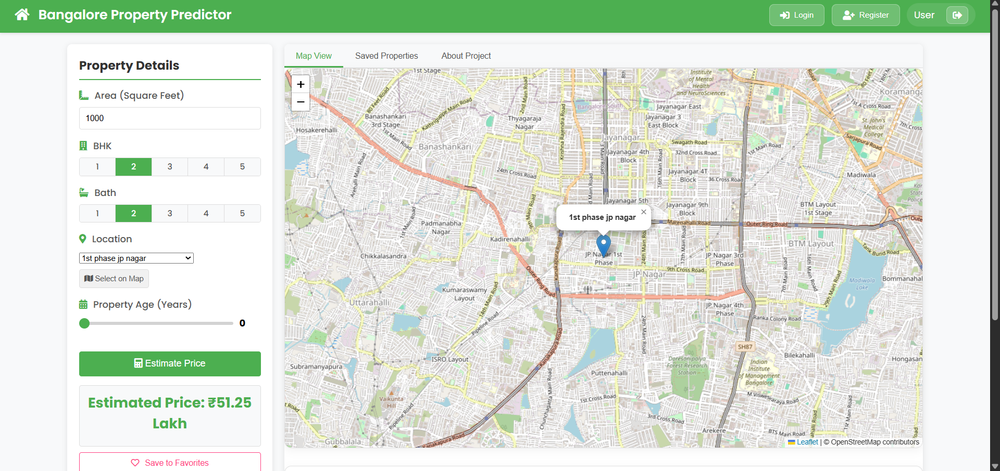
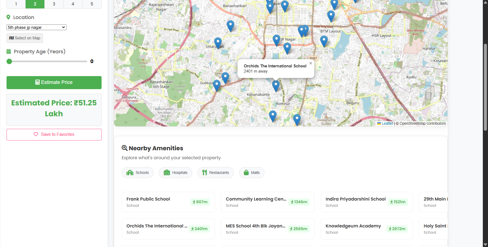
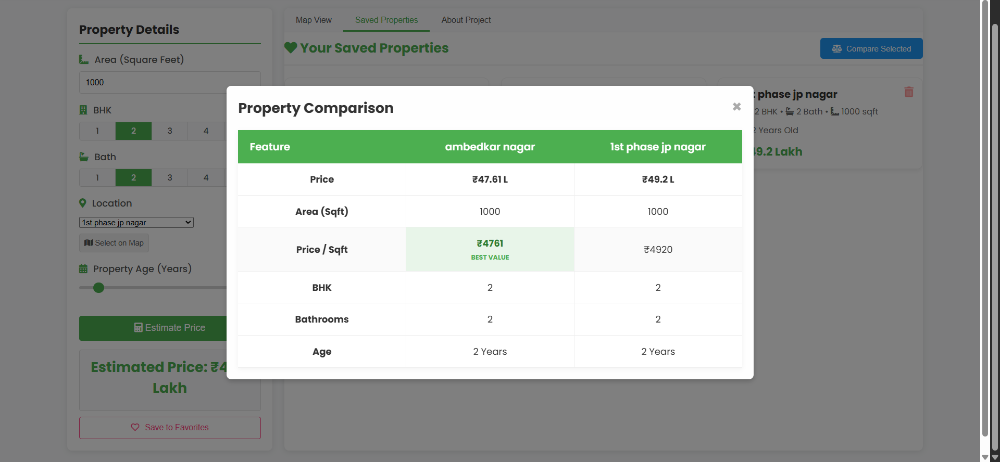

<p align="center">
  
</p>

<h1 align="center">🏠 Bangalore House Price Predictor</h1>

<p align="center">
  <strong>An intelligent, full-stack real estate valuation platform powered by Machine Learning</strong>
</p>

<p align="center">
  <a href="https://www.python.org/"></a>
  <a href="https://flask.palletsprojects.com/"></a>
  <a href="https://scikit-learn.org/"></a>
  <a href="https://leafletjs.com/"></a>
  <a href="https://www.chartjs.org/"></a>
  
</p>

<p align="center">
  <a href="https://bangalore-house-price-predictor-wvcn.onrender.com"></a>
</p>

<p align="center">
  <a href="#-key-features">Features</a> •
  <a href="#-system-architecture">Architecture</a> •
  <a href="#-tech-stack">Tech Stack</a> •
  <a href="#-getting-started">Getting Started</a> •
  <a href="#-api-reference">API</a> •
  <a href="#-deployment">Deployment</a> •
  <a href="https://bangalore-house-price-predictor-wvcn.onrender.com">Live Demo</a>
</p>

---

## 📋 Overview

The **Bangalore House Price Predictor** is a data-driven, full-stack web application that delivers accurate residential property valuations across **240+ localities** in Bangalore. Built on a **Random Forest Regressor** trained on **13,000+ cleaned real estate listings**, the platform combines predictive ML inference with interactive geospatial visualization and real-time amenity discovery — providing users with a comprehensive, one-stop property analysis tool.

> **Why this project?** Real estate pricing in Bangalore is notoriously opaque. This platform democratizes property valuation by making ML-powered insights accessible through an intuitive, map-driven interface.

---

## 📸 Screenshots

<p align="center">
  
  <br/><em>Home Page — Property Input Form & Interactive Map</em>
</p>

<p align="center">
  
  <br/><em>Nearby Amenities Discovery — Schools, Hospitals, Restaurants & Malls</em>
</p>

<p align="center">
  
  <br/><em>Side-by-Side Property Comparison</em>
</p>

---

## ✨ Key Features

| Feature | Description |
|---|---|
| 🤖 **ML Price Prediction** | Random Forest Regressor with optimized hyperparameters, delivering sub-second inference with age-based depreciation modeling |
| 🗺️ **Interactive Map** | Leaflet.js-powered map with heatmap overlays, click-to-select locations, and real-time geocoding via OpenStreetMap |
| 📍 **Amenity Discovery** | Discover nearby schools, hospitals, restaurants & malls via the Overpass API with distance-sorted results and multi-endpoint failover |
| 🔐 **User Authentication** | Secure registration & login system with Bcrypt password hashing and Flask-Login session management |
| ❤️ **Favorites & Comparison** | Save properties to favorites, compare them side-by-side with an interactive comparison modal |
| 📊 **Data Visualization** | Chart.js integration for property analytics and pricing trends |
| 🏗️ **Property Age Factor** | Realistic depreciation modeling — up to 40% reduction for 20-year-old properties |
| 🌐 **240+ Locations** | Comprehensive coverage across Bangalore with one-hot encoded location intelligence |

---

## 🏗 System Architecture

```
┌──────────────────────────────────────────────────────────────────┐
│                         CLIENT LAYER                             │
│  ┌──────────┐  ┌──────────────┐  ┌───────────┐  ┌────────────┐ │
│  │ HTML/CSS │  │ JavaScript   │  │ Leaflet.js│  │  Chart.js  │ │
│  │ Templates│  │ (app.js)     │  │ Maps      │  │  Analytics │ │
│  └────┬─────┘  └──────┬───────┘  └─────┬─────┘  └──────┬─────┘ │
│       └───────────────┴────────────────┴───────────────┘        │
│                            │  REST API                           │
├────────────────────────────┼─────────────────────────────────────┤
│                      SERVER LAYER                                │
│  ┌─────────────────────────┴──────────────────────────────────┐ │
│  │                    Flask Application                        │ │
│  │  ┌──────────┐  ┌───────────┐  ┌──────────┐  ┌──────────┐ │ │
│  │  │ Predict  │  │ Auth      │  │ Favorites│  │ Nearby   │ │ │
│  │  │ Endpoint │  │ System    │  │ System   │  │ Places   │ │ │
│  │  └────┬─────┘  └───────────┘  └──────────┘  └────┬─────┘ │ │
│  └───────┼───────────────────────────────────────────┼───────┘ │
│          │                                           │          │
├──────────┼───────────────────────────────────────────┼──────────┤
│        DATA & ML LAYER                               │          │
│  ┌──────┴──────┐  ┌────────────┐  ┌─────────────────┴───────┐ │
│  │ RF Model    │  │ SQLite DB  │  │ Overpass + Nominatim    │ │
│  │ (.pickle)   │  │ (Users,    │  │ (Geocoding & Amenities) │ │
│  │             │  │  Coords)   │  │                         │ │
│  └─────────────┘  └────────────┘  └─────────────────────────┘ │
└──────────────────────────────────────────────────────────────────┘
```

---

## 🛠 Tech Stack

### Backend
| Technology | Purpose |
|---|---|
| **Python 3.10+** | Core runtime |
| **Flask 3.0** | Web framework & REST API |
| **Scikit-Learn 1.5** | Random Forest Regressor model |
| **Pandas / NumPy** | Data preprocessing & feature engineering |
| **Flask-SQLAlchemy** | ORM for SQLite database |
| **Flask-Bcrypt** | Password hashing |
| **Flask-Login** | Session-based authentication |
| **Gunicorn** | Production WSGI server |

### Frontend
| Technology | Purpose |
|---|---|
| **HTML5 / CSS3 / JavaScript** | Core UI |
| **Leaflet.js 1.9** | Interactive maps & heatmap overlays |
| **Chart.js 3.7** | Data visualization |
| **jQuery 3.4** | AJAX requests & DOM manipulation |
| **Font Awesome 5** | Icon library |

### External APIs
| API | Purpose |
|---|---|
| **OpenStreetMap Nominatim** | Geocoding & reverse geocoding |
| **Overpass API** | Nearby amenity discovery (multi-endpoint failover) |

---

## 🚀 Getting Started

### Prerequisites

- Python **3.10** or higher
- pip (Python package manager)
- Git

### Installation

```bash
# 1. Clone the repository
git clone https://github.com/devang404/Bangalore-House-Price-Predictor.git
cd Bangalore-House-Price-Predictor

# 2. Create and activate a virtual environment
python -m venv venv

# Windows
.\venv\Scripts\activate

# macOS / Linux
source venv/bin/activate

# 3. Install dependencies
pip install -r requirements.txt

# 4. Run the application
python app.py
```

The app will be live at **`http://127.0.0.1:5000/`**

### (Optional) Retrain the Model

```bash
python train_optimized_model.py
```

This will re-process `BHP.csv`, perform outlier removal, and output a fresh `banglore_home_prices_model.pickle`.

---

## 📡 API Reference

| Method | Endpoint | Description |
|---|---|---|
| `POST` | `/predict_price` | Predict property price based on sqft, BHK, bath, location & age |
| `GET` | `/get_locations` | Retrieve all 240+ supported locations |
| `GET` | `/get_location_coords?location=<name>` | Get lat/lon coordinates for a location |
| `GET` | `/get_nearby_places?lat=<lat>&lon=<lon>&type=<type>` | Find nearby amenities (school, hospital, restaurant, mall) |
| `POST` | `/register` | Register a new user account |
| `POST` | `/login` | Authenticate an existing user |
| `GET` | `/logout` | End current session |
| `POST` | `/save_favorite` | Save a property to favorites *(auth required)* |
| `GET` | `/get_favorites` | Retrieve saved favorites *(auth required)* |
| `DELETE` | `/delete_favorite/<id>` | Remove a saved favorite *(auth required)* |

### Example — Price Prediction

```bash
curl -X POST http://localhost:5000/predict_price \
  -H "Content-Type: application/json" \
  -d '{
    "total_sqft": 1200,
    "bhk": 3,
    "bath": 2,
    "location": "indira nagar",
    "property_age": 5
  }'
```

**Response:**
```json
{
  "estimated_price": 185.42,
  "details": {
    "base_price": 205.45,
    "age_factor": 0.90
  }
}
```

---

## 🧠 ML Pipeline

```
Raw Data (13,320 listings)
    │
    ├── Drop irrelevant columns (area_type, society, balcony, availability)
    ├── Handle missing values
    ├── Convert sqft ranges to numeric averages
    ├── Extract BHK from 'size' field
    │
    ├── Feature Engineering
    │   ├── Price per sqft computation
    │   └── Location dimensionality reduction (threshold: ≤10 listings → "other")
    │
    ├── Outlier Removal
    │   ├── Sqft per BHK filter (< 300 sqft/BHK removed)
    │   ├── Price-per-sqft z-score filtering (per location)
    │   └── BHK cross-validation outlier removal
    │
    ├── One-Hot Encoding (240 locations)
    │
    └── Random Forest Regressor
        ├── n_estimators: 100
        ├── max_depth: 12
        ├── 80/20 train-test split
        └── R² Score: ~0.87
```

---

## ☁️ Deployment

This application is designed for single-platform deployment on **[Render](https://render.com)**.

### Deploy to Render (Recommended)

1. Push your code to GitHub
2. Create a new **Web Service** on Render
3. Connect your GitHub repository
4. Configure:
   - **Build Command:** `pip install -r requirements.txt`
   - **Start Command:** `gunicorn app:app`
   - **Environment:** Python 3
5. Deploy 🚀

> **Note:** The `Procfile` is already configured for Gunicorn-based deployment.

---

## 📁 Project Structure

```
Bangalore-House-Price-Predictor/
│
├── app.py                              # Flask application (routes, ML inference, auth)
├── train_optimized_model.py            # ML pipeline: data cleaning → training → export
├── init_db.py                          # Database initialization utility
│
├── banglore_home_prices_model.pickle   # Serialized Random Forest model (~3.8 MB)
├── columns.json                        # Feature column names (240+ locations)
├── BHP.csv                             # Raw Bangalore housing dataset
├── house_prices.db                     # SQLite DB (geocoordinates cache)
│
├── templates/
│   ├── app.html                        # Main application page
│   ├── login.html                      # Login page
│   └── register.html                   # Registration page
│
├── static/
│   ├── app.js                          # Frontend logic (prediction, map, amenities)
│   ├── app.css                         # Application styles
│   └── auth.css                        # Authentication page styles
│
├── requirements.txt                    # Python dependencies
├── Procfile                            # Gunicorn deployment config
└── .gitignore
```

---

## 🤝 Contributors

<table>
  <tr>
    <td align="center"><strong>Devang Nadkarni</strong><br/>System Architect & Developer<br/><a href="https://www.linkedin.com/in/devang-nadkarni-79066a319">LinkedIn</a></td>
    <td align="center"><strong>Yuvraj Mangutkar</strong><br/>Data Engineer<br/><a href="https://www.linkedin.com/in/yuvraj-mangutkar">LinkedIn</a></td>
    <td align="center"><strong>Sujit Kale</strong><br/>Frontend Developer</td>
    <td align="center"><strong>Manav Konde</strong><br/>Quality Analyst<br/><a href="https://www.linkedin.com/in/manav-konde-9b23242b1">LinkedIn</a></td>
  </tr>
</table>

---

## 📄 License

This project is licensed under the **MIT License** — see the [LICENSE](LICENSE) file for details.

---

<p align="center">
  <sub>Built with ❤️ in Bangalore</sub>
</p>
